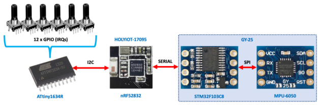
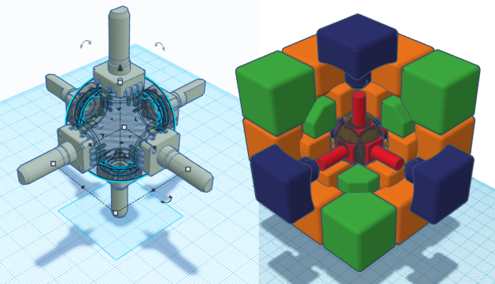
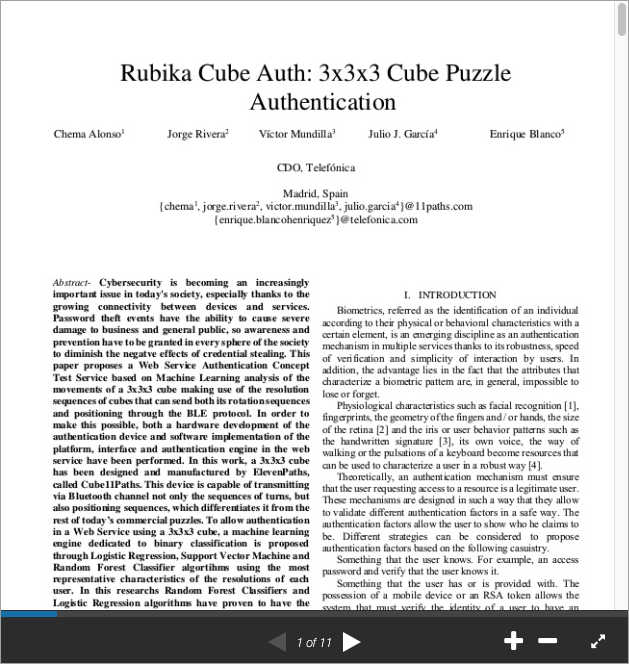

# Cube11Paths
Machine Learning authentication system, based on a custom Rubik's cube with encoders, inertial and gyroscopic sensors, connectable by Bluetooth Low Energy BLE (Giiker@ compatible).

 

## Cube Hardware

* 6x 12mm encoders [2-bit Quadrature (Gray coding)](https://en.wikipedia.org/wiki/Gray_code)
like as [ALPS EC12 Series](https://www.alps.com/prod/info/E/HTML/Encoder/Incremental/EC12E/EC12E_list.html)
* GY-25 IMU: [MPU-6050](https://www.invensense.com/products/motion-tracking/6-axis/mpu-6050/) & [DMP STM32F103C8](https://www.st.com/en/microcontrollers-microprocessors/stm32f103c8.html)
* BLE Transceiver: [HolyIoT-17095](http://www.holyiot.com/eacp_view.asp?id=298) based on [Nordic nRF52832](https://www.nordicsemi.com/Products/Low-power-short-range-wireless/nRF52832) ARM® Cortex-M4F SoC
* Core Microcontroller: [Microchip-Atmel Tiny1634R](https://www.microchip.com/wwwproducts/en/ATTINY1634)
* Battery: 3.7v LiPo cell (60mAh) like [ref 401215](https://www.google.com/search?tbm=isch&sa=1&q=lipo+401215)

## 3D Models
3D printed cube parts from custom desing (Thank you very much Xavi Val!!!)

## Frontend Web
Comming soon...

## Machine Learning
ML details are descripts in this academic paper: [Rubika Cube Auth: 3x3x3 Cube Puzzle Authentication](https://www.slideshare.net/elevenpaths/rubika-cube-auth-3x3x3-cube-puzzle-authentication)

## RUBIKA: Anti [Rubber-hose](https://en.wikipedia.org/wiki/Rubber-hose_cryptanalysis) attacks PoC
Worldwide presentation at [OpenExpo Europe 2019](https://openexpoeurope.com) on June 29, by [Chema Alonso](https://twitter.com/chemaalonso)

Posted at [http://www.elladodelmal.com blog: part 1](https://www.elladodelmal.com/2019/06/rubika-un-sistema-anti-rubber-hose.html), [part 2](https://www.elladodelmal.com/2019/06/rubika-un-sistema-anti-rubber-hose_24.html), [part 3](https://www.elladodelmal.com/2019/06/rubika-un-sistema-anti-rubber-hose_27.html), [part 4](https://www.elladodelmal.com/2019/07/rubika-un-sistema-anti-rubber-hose.html), and [part 5](https://www.elladodelmal.com/2019/07/rubika-un-sistema-anti-rubber-hose_11.html).

## License

This program is free software: you can redistribute it and/or modify it under the terms of the GNU General Public License as published by the Free Software Foundation, either version 3 of the License, or (at your option) any later version.

This program is distributed in the hope that it will be useful, but WITHOUT ANY WARRANTY; without even the implied warranty MERCHANTABILITY or FITNESS FOR A PARTICULAR PURPOSE.  See the GNU General Public License [LICENSE](LICENSE.md) for more details.

You should have received a copy of the GNU General Public License along with this program.  If not, see <http://www.gnu.org/licenses/>  for details.

## Disclaimer

THE SOFTWARE IS PROVIDED "AS IS", WITHOUT WARRANTY OF ANY KIND, EXPRESS OR IMPLIED, INCLUDING BUT NOT LIMITED TO THE WARRANTIES OF MERCHANTABILITY, FITNESS FOR A PARTICULAR PURPOSE AND NONINFRINGEMENT. IN NO EVENT SHALL THE AUTHORS OR COPYRIGHT HOLDERS BE LIABLE FOR ANY CLAIM, DAMAGES OR OTHER LIABILITY, WHETHER IN AN ACTION OF CONTRACT, TORT OR OTHERWISE, ARISING FROM, OUT OF OR IN CONNECTION WITH THE SOFTWARE OR THE USE OR OTHER DEALINGS IN THE SOFTWARE.
